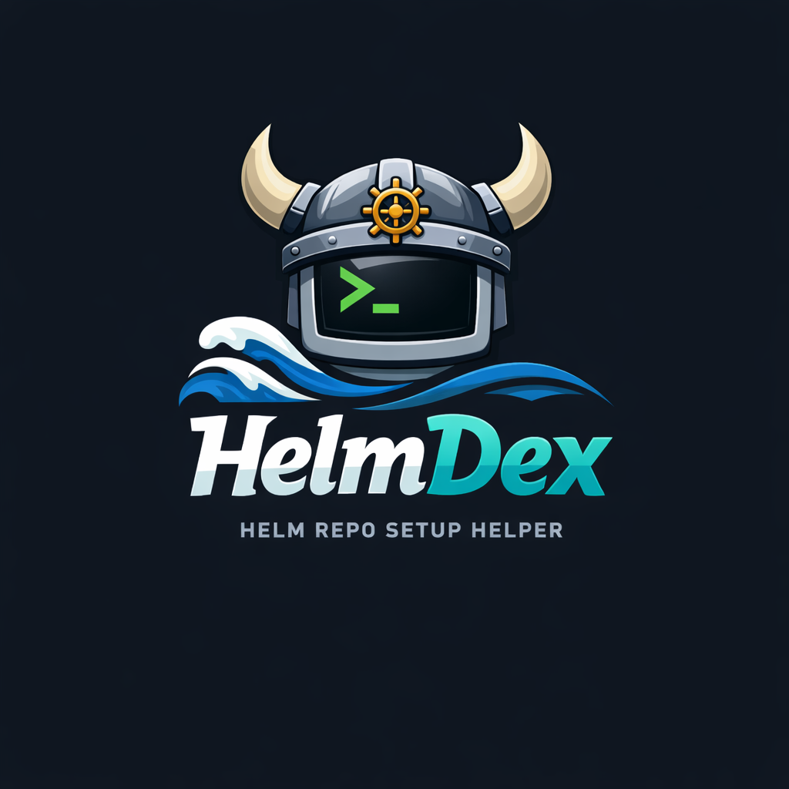

<div align="center">
  

  <h1>helmdex</h1>

  <p>TUI organizer for Helm umbrella chart instances — no rendering, no deploy.</p>
</div>

---

## Goals

Managing multiple [umbrella chart](https://helm.sh/docs/howto/charts_tips_and_tricks/#complex-charts-with-many-dependencies) instances across environments means juggling dependency versions, layered values files, and platform-specific overrides — all while keeping everything reviewable in Git.

`helmdex` handles that scaffolding: it creates instance directories, resolves and merges values layers, and lets you browse/edit everything from a TUI. It never renders templates or deploys — it is purely a **configuration management and organization layer** on top of Helm.

## Key concepts

| Concept | What it is |
|---|---|
| **Instance** | One umbrella chart project, stored in `apps/<name>/` |
| **Dependency** | A Helm chart listed in the instance's `Chart.yaml` |
| **Values layers** | Ordered merge: `default → platform → sets → instance` |
| **Catalog** | Curated chart+version entries your team can add from |
| **Presets / sets** | Versioned YAML values files bundled with catalog entries |
| **Source** | A Git repo (or local dir) that provides a catalog and/or presets |

### Values merge order

```
values.default.yaml          ← chart defaults from preset source
values.platform.yaml         ← platform overrides (e.g. eks, gke)
values.set.<name>.yaml       ← named configuration sets
values.dep-set.<id>--<set>.yaml  ← per-dependency set files
values.instance.yaml         ← your overrides  ← highest priority, hand-edited
──────────────────────────────────────────────
values.yaml                  ← generated merged output (committed, reviewed in PRs)
```

---

## Install

```bash
go install github.com/SocialGouv/helmdex/cmd/helmdex@latest
```

## Quick start

```bash
helmdex init   # create helmdex.yaml at repo root
helmdex        # open TUI
```

Running `helmdex` with no arguments opens the interactive dashboard when stdin is a TTY. Outside a TTY (pipe, CI) it prints help instead.

---

## TUI

### Navigation

The TUI opens on the **Dashboard** — a list of all instances. Press `enter` to open an instance.

The terminal window title tracks your location:

```
🧭 HelmDex › my-app
🧭 HelmDex › my-app › Add dep › Catalog
🧭 HelmDex › my-app › Dependency detail
```

| Env var | Effect |
|---|---|
| `HELMDEX_NO_TITLE=1` | Disable window title updates |
| `HELMDEX_NO_ICONS=1` | Disable emoji/icons (inconsistent width in some terminals) |

### Instance tabs

| Tab | What you can do |
|---|---|
| **Dependencies** | Add, remove, inspect, and upgrade chart dependencies |
| **Configure** | Edit per-dependency value overrides |
| **Values** | Browse all values layer files for this instance |
| **Sets** | Toggle preset sets per dependency |

### Common keys

| Key | Action |
|---|---|
| `↑` / `↓` | Navigate list |
| `enter` | Select / open |
| `esc` / `q` | Back / quit |
| `a` | Add dependency |
| `x` | Dependency actions menu |
| `s` | Save |
| `space` | Toggle |
| `D` | Toggle all default sets |
| `?` | Help / about |

### Adding a dependency

From the **Dependencies** tab, press `a` to start the wizard:

- **Predefined catalog** — pick from synced catalog entries; toggle sets with `space`, `D` for all defaults, `enter` to add + apply
- **Artifact Hub** — search charts directly from the TUI
- **Arbitrary** — enter a repo URL, name, and version manually

### Working with presets on an existing dependency

Press `x` on a dependency to open the actions menu:

- **Dependency detail** (`enter`) → **Sets** tab — toggle sets and press `s` to save + apply
- **Sync presets** — fetch latest preset cache, remove orphan set markers, re-import, and regenerate merged values

---

## Catalog and presets

A **catalog** is a curated list of chart+version entries. **Presets** are versioned YAML values files bundled with those entries. Both live in a *source* — a separate Git repo (or local directory).

### Configure a source (`helmdex.yaml`)

```yaml
apiVersion: helmdex.io/v1alpha1
kind: HelmdexConfig

repo:
  appsDir: apps        # where instances live (default: apps)

platform:
  name: eks            # used to resolve values.platform.<name>.yaml

sources:
  - name: my-catalog
    git:
      url: https://github.com/acme/helmdex-catalog.git
      ref: main        # branch, tag, or commit (optional)
    catalog:
      enabled: true
      path: catalog.yaml
    presets:
      enabled: true
      chartsPath: charts

artifactHub:
  enabled: true        # Artifact Hub integration (default: true)
```

### Sync sources

```bash
helmdex catalog sync
```

Downloads catalog entries into `.helmdex/catalog/` and preset files into `.helmdex/cache/`.

### Try the built-in example (no network)

This repo ships a self-contained fixture at [`fixtures/remote-source/`](fixtures/remote-source/README.md).

**Option A — filesystem source:**

```yaml
sources:
  - name: example
    git:
      url: fixtures/remote-source
    catalog:
      enabled: true
      path: catalog.yaml
    presets:
      enabled: true
      chartsPath: charts
```

**Option B — local git repo (mirrors real-world sync behavior):**

```bash
cp -a fixtures/remote-source /tmp/helmdex-example-remote-source
cd /tmp/helmdex-example-remote-source
git init && git config user.email e2e@example.invalid && git config user.name helmdex-example
git add -A && git commit -m 'example catalog + presets'
```

Point `git.url` at `/tmp/helmdex-example-remote-source`, then:

```bash
helmdex catalog sync
helmdex
```

> For filesystem sources (no `.git` folder), `git.ref` is ignored during sync and cleared on save.

### Preset version matching

Preset files are organized as `charts/<name>/<version-or-constraint>/values.*.yaml`. helmdex resolves the best match using SemVer constraints — a preset at `nginx/^15.0.0` matches any `15.x.x` dependency.

### If the local catalog is empty

When you open **Add dependency → Predefined catalog** and no entries are found, helmdex attempts a one-time auto-sync for the session. If there is no config or no sources, the wizard offers shortcuts to **Configure sources** and retry.

---

## Instance directory layout

```
apps/my-app/
├── Chart.yaml                        # umbrella chart + dependencies
├── Chart.lock                        # dependency lock (from helm dependency build)
├── values.default.yaml               # from preset source  ─┐
├── values.platform.yaml              # platform layer       │  generated,
├── values.set.<name>.yaml            # named set(s)         │  do not edit
├── values.dep-set.<id>--<set>.yaml   # per-dep set(s)      ─┘
├── values.instance.yaml              # your overrides  ← edit this
└── values.yaml                       # merged output   ← generated
```

The **Values** tab in the TUI lists each file with a short description and lets you preview its contents with syntax highlighting.

---

## CLI reference

All TUI capabilities are also available as non-interactive commands, suitable for CI and scripts.

### Instances

```bash
helmdex instance create <name>
helmdex instance list
helmdex instance apply <name>          # lock deps, import presets, regen values.yaml
helmdex instance update <name>         # regen values (optionally relock)
helmdex instance rm <name> --yes
```

### Instance values

Read and write `values.instance.yaml` by JSONPath (`$.key.sub`):

```bash
helmdex instance values get    <name> --path '$.global.replicas'
helmdex instance values set    <name> --path '$.global.replicas' --value-yaml '3'
helmdex instance values unset  <name> --path '$.global.replicas'
helmdex instance values replace <name> --stdin
helmdex instance values replace <name> --file vals.yaml
helmdex instance values regen  <name>
```

### Dependency management

```bash
helmdex instance dep add <instance> \
  --repo https://charts.bitnami.com/bitnami \
  --name nginx --version 15.0.0 [--alias my-nginx] [--set production]

helmdex instance dep add <instance> \
  --repo oci://registry-1.docker.io/cloudpirates/postgres \
  --name postgres --version 0.16.0

helmdex instance dep add-from-catalog <instance> --id <entry-id> [--apply] [--set <set>]
helmdex instance dep list <instance>
helmdex instance dep rm <instance> <depID>
helmdex instance dep set-version <instance> <depID> --version 15.1.0 [--apply]
helmdex instance dep upgrade <instance> <depID> [--apply]
```

### Per-dependency value overrides

Paths are relative to the dependency root in `values.instance.yaml`:

```bash
helmdex instance dep values get    <instance> <depID> --path '$.replicaCount'
helmdex instance dep values set    <instance> <depID> --path '$.replicaCount' --value-yaml '2'
helmdex instance dep values unset  <instance> <depID> --path '$.replicaCount'
```

### Dependency inspection

Uses vendored chart → archive cache → helm show cache → pull (best-effort, cached):

```bash
helmdex instance dep inspect readme  <instance> <depID>
helmdex instance dep inspect values  <instance> <depID>
helmdex instance dep inspect schema  <instance> <depID>
```

### Presets

```bash
helmdex instance presets resolve     <instance>
helmdex instance presets resolve-dep <instance> <depID>
```

### Catalog

```bash
helmdex catalog sync
helmdex catalog list  [--format json|table]
helmdex catalog get <id> [--format json|table]
```

### Artifact Hub

```bash
helmdex artifacthub search <query> [--limit 20] [--format json|table]
helmdex artifacthub versions <repoKey> <package> [--format json|table]
```

### OCI registry

```bash
helmdex registry login <registry> [--username <u>] [--password-stdin]
```

If you hit Docker Hub rate limits, login stores credentials in a helmdex-isolated store (separate from your system Docker config).

### Cache

```bash
helmdex cache clear [--helm]   # clear show/version cache; --helm also clears helm env
```

---

## Advanced

### Pin a source to a specific git ref

`ref` in a source accepts any branch, tag, or commit SHA. On sync it is resolved to a commit and stored back in `helmdex.yaml` under `commit:` for reproducibility.

### YAML syntax highlighting

YAML previews (instance values, Artifact Hub "Values", dependency "Default") are syntax-highlighted with ANSI colors, suppressed when `NO_COLOR` is set or `TERM=dumb`.

### Markdown rendering

README previews (Artifact Hub detail, dependency detail "README") are rendered as Markdown to ANSI.

---

## Development

```bash
go build ./...
go test ./...
```

E2E tests live in `tests/`. The fixture at `fixtures/remote-source/` is a self-contained example catalog + presets source used by tests and local development.
