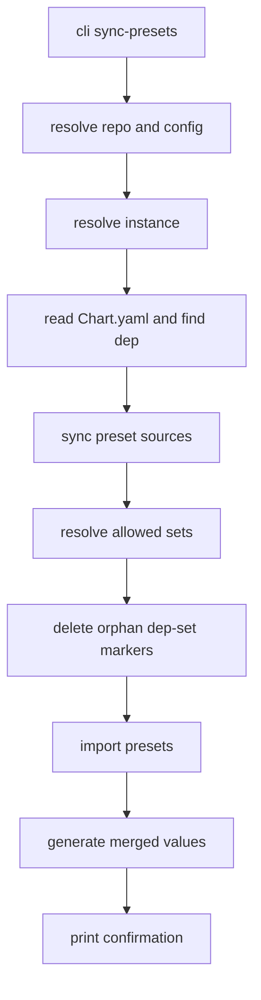

# CLI parity patch spec: detach + sync-presets

Scope (as agreed): implement **two missing CLI commands** that exist in the TUI:

- `helmdex instance dep detach <instance> <depID>`
- `helmdex instance dep sync-presets <instance> <depID>`

The parity target is the behavior exposed via TUI palette items:

- Detach: [`palDepDetachCatalog`](internal/tui/palette.go:19) → [`detachDepFromCatalogCmd()`](internal/tui/model.go:1080)
- Sync presets: [`palDepSyncPresets`](internal/tui/palette.go:19) → [`syncSelectedDepPresetsCmd()`](internal/tui/model.go:1470)

Non-goals for this patch:

- Making `helmdex instance dep add-from-catalog` write depmeta.
- Enriching `helmdex instance dep list` output.

---

## Background: depmeta

Detach is implemented by updating per-dependency source metadata (depmeta) stored at:

`<repoRoot>/.helmdex/depmeta/<instanceName>/<depID>.yaml`

Schema (TUI): [`depSourceMeta`](internal/tui/depmeta.go:23)

For the minimal parity patch, the CLI will:

- read and write the same depmeta files
- avoid importing the `tui` package (recommended), by duplicating only the tiny YAML read/write bits in CLI

---

## Command 1: `helmdex instance dep detach`

### UX

**Use**: `detach <instance> <depID>`

**Goal**: switch the dependency from catalog-attached to arbitrary by writing depmeta:

```yaml
kind: arbitrary
```

### Behavior

1. Resolve repo root + config using existing helper:
   - [`resolveRepoAndConfig()`](internal/cli/instance_helpers.go:12)
2. Resolve instance:
   - [`resolveInstanceByName()`](internal/cli/instance_helpers.go:28)
3. Ensure the dependency exists in `Chart.yaml`:
   - [`readInstanceChart()`](internal/cli/instance_helpers.go:32)
4. Read depmeta file for `<instanceName>/<depID>`.
5. If depmeta missing OR `kind != catalog`, return an error:
   - match TUI semantics: catalog-only action
6. Overwrite depmeta with `kind: arbitrary` and no catalog fields.
7. Print a single-line confirmation to stdout.

### Output

- Success: `Detached <depID> from catalog in <instance>`
- Errors should be actionable and include `depID` and `instance`.

### Implementation placement

- Add new cobra command builder in a new file (preferred): [`internal/cli/instance_dep_parity.go`](internal/cli/instance_dep_parity.go:1)
  - alternative: extend [`internal/cli/instance_dep_extra.go`](internal/cli/instance_dep_extra.go:20)
- Register in [`newInstanceDepCmd()`](internal/cli/instance.go:37)

---

## Command 2: `helmdex instance dep sync-presets`

### UX

**Use**: `sync-presets <instance> <depID>`

**Goal**: mimic TUI action Sync presets selected dep:

- sync preset cache for all sources with presets enabled
- remove orphan per-dep set marker files
- re-import presets
- regenerate merged `values.yaml`

### Behavior (mirrors TUI)

Implementation should follow the same steps as [`syncSelectedDepPresetsCmd()`](internal/tui/model.go:1470):

1. Resolve repo root + config using [`resolveRepoAndConfig()`](internal/cli/instance_helpers.go:12).
2. Resolve instance using [`resolveInstanceByName()`](internal/cli/instance_helpers.go:28).
3. Read `Chart.yaml` and locate the dependency by `depID`.
4. Sync cache for all sources where `src.Presets.Enabled` is true.
   - same approach as TUI: `catalog.NewSyncer(repoRoot).SyncFiltered(...)
5. Resolve allowed sets for only that dependency using [`presets.Resolve()`](internal/presets/resolve.go:33).
6. Remove orphan markers in `<instancePath>`:
   - marker glob: `values.dep-set.<depID>--*.yaml`
   - parse `<setName>` from filenames and delete any not in `allowedSets`
   - logic can be copied from [`removeOrphanDepSetMarkers()`](internal/tui/model.go:1385)
7. Re-import presets for the whole instance using [`presets.Import()`](internal/presets/import.go:1).
8. Regenerate merged values using [`values.GenerateMergedValues()`](internal/values/generate.go:1).
9. Print a single-line confirmation to stdout.

### Output

- Success: `Synced presets for <depID> in <instance> (values regenerated)`

### Error cases

- No config: should not happen because CLI requires config load, but preserve the same failure mode.
- Dependency not found in `Chart.yaml`.
- Sync failure (git errors, filesystem errors).

---

## Mermaid flow (sync-presets)



---

## Tests

Add a hermetic e2e-ish test similar to [`TestE2E_RemoteCatalogAndSets_Hermetic()`](internal/cli/e2e_remote_catalog_sets_test.go:24), but focusing on the new commands:

### A) Detach command test

1. Create repo + config + sync catalog.
2. Create instance + add dep from catalog.
3. Determine `depID` (reuse helper like `onlyDepID` in [`internal/cli/e2e_remote_catalog_sets_test.go`](internal/cli/e2e_remote_catalog_sets_test.go:208)).
4. Manually write depmeta file at `.helmdex/depmeta/<instance>/<depID>.yaml` with:
   - `kind: catalog`
   - `catalogID: <entry-id>`
   - `catalogSource: <sourceName>`
5. Run: `helmdex instance dep detach <instance> <depID>`
6. Assert depmeta yaml now contains `kind: arbitrary`.

### B) Sync-presets command test

1. Same setup as A (repo + config + remote source + sync).
2. Create an orphan marker file:
   - `apps/<instance>/values.dep-set.<depID>--does-not-exist.yaml`
3. Run: `helmdex instance dep sync-presets <instance> <depID>`
4. Assert orphan marker file was deleted.
5. Assert `apps/<instance>/values.yaml` exists and is valid YAML.

Notes:

- Keep tests hermetic by reusing the existing fixture remote source pattern in [`internal/cli/e2e_remote_catalog_sets_test.go`](internal/cli/e2e_remote_catalog_sets_test.go:24).
- The command does not relock, so no Helm binary is required (matching the existing e2e strategy).

---

## Files expected to change (implementation)

- Register new subcommands:
  - [`internal/cli/instance.go`](internal/cli/instance.go:37)
- Add new command implementations + small shared helpers:
  - (new) [`internal/cli/instance_dep_parity.go`](internal/cli/instance_dep_parity.go:1)
  - or extend [`internal/cli/instance_dep_extra.go`](internal/cli/instance_dep_extra.go:20)
- Add/extend tests:
  - (new or extend) [`internal/cli/e2e_dep_parity_test.go`](internal/cli/e2e_dep_parity_test.go:1)

