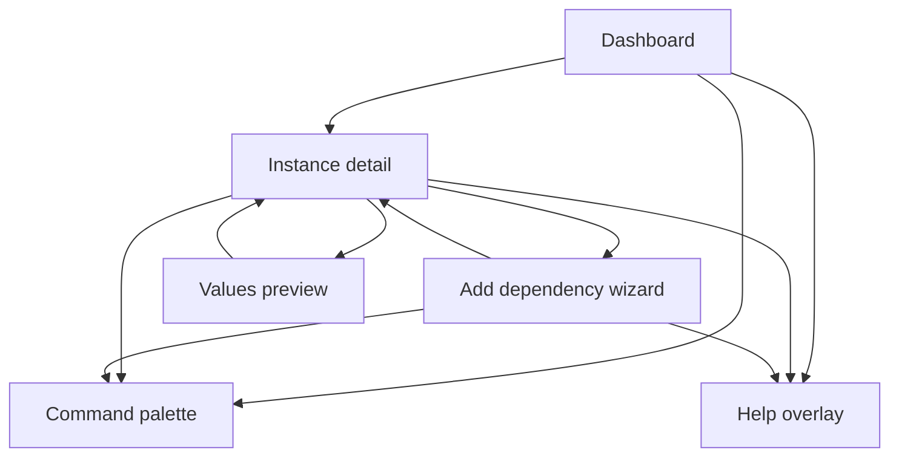

# Helmdex TUI balanced upgrade spec (navigation + help + status bar first)

Scope: improve intuitiveness and power while **not changing existing CLI commands** (the entrypoint remains [`internal/cli/tui.go`](internal/cli/tui.go:1) calling [`tui.Run()`](internal/tui/app.go:27)).

This spec is designed to be implemented incrementally from the current monolithic Bubble Tea model in [`internal/tui/model.go`](internal/tui/model.go:1).

## 0) Baseline: current friction points

Observed in [`AppModel.Update()`](internal/tui/model.go:406) and [`AppModel.View()`](internal/tui/model.go:879):

- **Action discovery is weak**: dashboard has only a faint `m: menu` hint and the menu is a list modal with no filter.
- **Help is always-on but shallow**: `ShortHelp()` exists, `FullHelp()` exists, but there is no help overlay and no per-screen help.
- **No status bar**: errors are either shoved into the instance viewport or modal error line; there is no consistent place for state like FILTERING, LOADING, selection, or repo.
- **Navigation inconsistencies**:
  - `Backspace` is in the keymap but not used; `esc` is used for back.
  - left/right are overloaded between instance tabs and AH detail tabs.
  - dashboard and instance screens use different affordances.
- **Instance tabs are stubbed** in [`renderInstanceTab()`](internal/tui/model.go:950) and don’t expose the existing backend capabilities (ex: values generation via [`values.GenerateMergedValues()`](internal/values/generate.go:21)).

## 1) UX conventions (global)

### 1.1 Global keys

The following keys should work everywhere unless a focused input or filter is active (reuse the intent in [`inputCapturesKeys()`](internal/tui/model.go:1080)).

| Key | Action | Notes |
|---|---|---|
| `q`, `ctrl+c` | quit | already in [`keyMap.Quit`](internal/tui/model.go:139) |
| `esc` | back / close modal / clear filter | consistent “one level up” |
| `?` | toggle help overlay | new |
| `m` | open command palette | replace the current actions list modal |
| `/` | start filtering on focused list | uses bubbles/list built-in filtering |
| `enter` | open / confirm | already in [`keyMap.Open`](internal/tui/model.go:141) |
| `j/k` and arrows | move selection | bubbles/list already supports arrows; add j/k where needed |
| `h/l` or left/right | tab left/right | already present for tabs |
| `ctrl+r` or `f5` | reload | already in [`keyMap.Reload`](internal/tui/model.go:142) |

Notes:

- When filtering is active, `esc` should **exit filtering** first, then close modals, then navigate back.
- Inputs should show an “INSERT” indicator in the status bar.

### 1.2 Layout

We standardize on 3 persistent regions:

1. **Header** (existing): app name + repo root.
2. **Body**: active screen or modal.
3. **Status bar** (new): single-line, high signal.

Proposed status bar structure:

- Left: breadcrumb `Dashboard` or `Instance / <name>` or `Instance / <name> / Add dep`
- Middle: selection summary `3 deps • values.yaml ok` or `Artifact Hub: <chart> @ <version>`
- Right: mode indicators `FILTER` `INSERT` `LOADING` plus time or repo short.

Errors:

- Modal flows show error at top of modal (existing pattern in [`renderAddDepView()`](internal/tui/model.go:1041)).
- Non-modal errors show in status bar as `ERR <message>` for a few seconds (then fade to last non-error status).

## 2) Help overlay

Help overlay is toggled by `?`.

Content:

- Global keys (table above)
- Context keys (screen-specific)
- “Input capture rule” hint: when filtering or typing, global shortcuts are disabled

Implementation strategy (Bubble Tea):

- Maintain `helpOpen bool` in the root model.
- Render overlay by composing the normal view and an overlay panel (lipgloss) anchored to center.

## 3) Command palette (replace actions menu)

We replace `actionsOpen` + `actions list.Model` with a **command palette**:

- Open with `m`
- Has a text input at top and a list below
- As you type, list is filtered (we can either use list filtering or manual filtering)
- `enter` runs selected command
- `esc` closes

Initial commands:

- Dashboard: New instance, Reload, Sync catalog (future), Quit
- Instance: Add dep, Remove dep, Edit values in editor, Regenerate values.yaml, Back
- Add-dep detail: Force refresh chart detail (existing), Add selected dependency

The palette should show each command’s key hint if one exists.

## 4) Screen-specific improvements

### 4.1 Dashboard

Enhancements without new backend:

- Add a secondary line per instance showing:
  - deps count (parse `Chart.yaml` already done via [`loadChartCmd()`](internal/tui/model.go:335) once selected; for the dashboard we can lazy-load on selection or precompute)
  - whether `values.yaml` exists
- Visible hint line: `/ filter • enter open • m commands • n new`

### 4.2 Instance detail

Make tabs real (build on existing tab framework in [`renderTabs()`](internal/tui/model.go:911)):

- Overview: show `Chart.yaml` summary and file presence checks
- Deps: render list of dependencies from loaded chart; add remove/edit actions using existing YAML helpers like [`Chart.UpsertDependency()`](internal/yamlchart/edit.go:18) and [`Chart.RemoveDependencyByID()`](internal/yamlchart/edit.go:48)
- Values: show selectable list of known value layers + viewport preview; include:
  - `e` open `$EDITOR` for `values.instance.yaml` (suspend alt screen)
  - `r` regenerate `values.yaml` via [`values.GenerateMergedValues()`](internal/values/generate.go:21)
- Presets: placeholder panel for now if presets resolution not implemented

### 4.3 Add dependency wizard

Keep the existing wizard state machine but make it clearer:

- Add breadcrumb line `Add dep / Source` `Add dep / Artifact Hub / Results` etc
- Add step hint line (keys) per step
- Ensure `esc` backs up one step (or closes modal if at first step)
- Add a final confirmation panel before applying draft to disk (shows target instance + dep name/repo/version)

## 5) Architecture refactor (after UX conventions land)

Goal: stop growing the monolith in [`internal/tui/model.go`](internal/tui/model.go:1).

Proposed structure (aligning with the intent in [`plans/v0.2-tui.md`](plans/v0.2-tui.md:142)):

- `internal/tui/app.go` keeps `Run()` only
- `internal/tui/model.go` becomes a thin root model + shared services
- New packages:
  - `internal/tui/screens/dashboard.go`
  - `internal/tui/screens/instance.go`
  - `internal/tui/components/statusbar.go`
  - `internal/tui/components/commandpalette.go`
  - `internal/tui/components/helpoverlay.go`

Introduce a small interface:

- `screen.Init()` returns a `tea.Cmd`
- `screen.Update(msg)` returns `(screen, tea.Cmd)`
- `screen.View()`
- `screen.Help()` returns context help strings
- `screen.Status()` returns status bar model

Root model routes messages to the active screen and composes header/body/status.

## 6) Mermaid map

