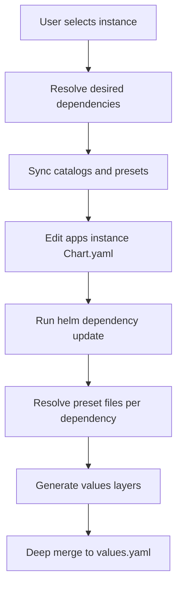

# Helmdex v0.1 spec (working draft)

## Scope

`helmdex` is a Go interactive CLI (TUI-first) to **organize** a GitOps repository containing **Helm umbrella chart instances**.

Non-goals:

- No manifest rendering (CI runs `helm template`).
- No deployment / cluster interactions.

Primary responsibilities:

- Create/read/update/delete instances (umbrella charts).
- Manage `Chart.yaml` dependencies (add/remove/pin versions, optionally alias).
- Maintain lockfile (`Chart.lock`) via `helm dependency update` / `helm dependency build`.
- Generate layered values artifacts (including optional platform presets) and a merged `values.yaml`.

## Repository on-disk contract

### Repo root

- Root config file: [`helmdex.yaml`](helmdex.yaml)
- Optional internal state/cache dir (recommended): [`.helmdex/`](.helmdex/)

### Instances

Instances live under a configurable directory (`appsDir`, default `apps`).

Path:

- `<appsDir>/<instanceName>/`

Files:

- `Chart.yaml` (helmdex-managed)
- `Chart.lock` (helmdex-managed; produced by Helm)
- `charts/` (optional; populated by Helm dependency commands)
- `values.instance.yaml` (user-edited)
- Generated layer files (helmdex-managed; optional depending on presets/sets):
  - `values.default.yaml`
  - `values.platform.yaml`
  - `values.set.<setName>.yaml` (0..N)
- `values.yaml` (helmdex-generated; deep-merged)

Dependency value keying:

- Values are keyed by dependency identifier = `alias` if set, else `name`.
- Enforce uniqueness across dependencies.

## Values layering rules

Helm chart default values (inside the subchart) are overridden by repo-managed layers in this order:

1. `values.default.yaml` (optional, generated)
2. `values.platform.yaml` (optional, generated)
3. `values.set.<setName>.yaml` (0..N, generated, applied in user-defined order)
4. `values.instance.yaml` (required, user-edited)

Deep merge semantics:

- Map keys: recursively merged.
- Scalars: last writer wins.
- Arrays: replaced (no element-wise merge).

### Generated content shape

All generated layer files are **umbrella-root values files** whose top-level keys are dependency identifiers.

Example (`values.platform.yaml`):

```yaml
postgresql:
  primary:
    persistence:
      enabled: true
redis:
  auth:
    enabled: false
```

`values.yaml` is generated by applying the merge chain **including** `values.instance.yaml`.

Operational contract:

- Users edit `values.instance.yaml` only.
- Helmdex regenerates `values.yaml` and the optional layer files.
- CI uses only `-f values.yaml`.

Ownership rules:

- `values.instance.yaml` is **user-owned** and must never be overwritten by helmdex in v0.1.
- A later milestone may add an interactive editor to help users modify `values.instance.yaml` intentionally.

## Remote preset + catalog contract

## Root config schema (v0.1)

Root config lives at repo root: [`helmdex.yaml`](helmdex.yaml)

Proposed schema (minimal, v0.1, unified remote sources for presets + catalogs):

```yaml
apiVersion: helmdex.io/v1alpha1
kind: HelmdexConfig

repo:
  # Directory containing instances
  appsDir: apps

platform:
  # Used to select remote `values.platform.<platform>.yaml`
  name: eks

sources:
  - name: company-defaults
    git:
      url: https://github.com/acme/helmdex-presets.git
      # Optional moving ref, resolved and recorded on `catalog sync`
      ref: main
      # Optional fixed pin (preferred for reproducibility)
      commit: 0123456789abcdef0123456789abcdef01234567
    presets:
      enabled: true
      # Root folder for preset lookup (matches your remote repo contract)
      chartsPath: charts
    catalog:
      enabled: true
      # Relative path within this source repo
      path: catalog.yaml

artifactHub:
  enabled: true
```

Validation rules (v0.1):

- `apiVersion` and `kind` must match.
- `repo.appsDir` defaults to `apps`.
- `platform.name` required if `presets.sources` is non-empty.
- `sources[]` may be empty (no remote presets/catalog).
- Each `sources[].name` must be unique.
- `sources[].git.url` required.
- If both `git.ref` and `git.commit` are set, `git.commit` is authoritative.
- `platform.name` required if any `sources[].presets.enabled` is `true`.

Local cache layout (recommended):

- [`.helmdex/cache/<sourceName>/`](.helmdex/cache/<sourceName>/) contains a git checkout.
- [`.helmdex/cache/<sourceName>/meta.yaml`](.helmdex/cache/<sourceName>/meta.yaml) records `resolvedCommit` when syncing a moving ref.

### Preset source

One or more remote sources are configured in [`helmdex.yaml`](helmdex.yaml) and point to a git repository.

- Pin by commit SHA (preferred) or allow a free ref like `main`.
- The CLI supports `catalog sync` to fetch/update the local cache.

Remote preset repo layout (per your decision):

- `charts/<chartName>/<version-or-version-range>/values.platform.<platform>.yaml`
- `charts/<chartName>/<version-or-version-range>/values.default.yaml`
- `charts/<chartName>/<version-or-version-range>/values.set.<set-name>.yaml`
- `catalog.yaml`

Notes:

- `<chartName>` in the preset repo refers to the *Helm chart name* as used in dependency `name`.
- `<version-or-version-range>` supports:
  - exact version directory e.g. `1.2.3`
  - range directory e.g. `>=1.0.0 <2.0.0`
  - wildcard directory e.g. `1.2.x`

Matching rules:

- For each dependency in `Chart.yaml`, identify remote chartName (dependency `name`) and pinned version.
- Find the best matching `<version-or-version-range>` directory (semver exact match first, else best satisfying range).
- For platform layer, pick `values.platform.<platform>.yaml` where `<platform>` comes from root config.
- For sets, include any `values.set.<setName>.yaml` where `setName` is selected by user.

Multiple preset sources:

- Sources are applied in config order.
- Within a layer type (default/platform/set), later sources override earlier sources.

### Predefined catalog

Predefined catalog entries live in remote `catalog.yaml` (within any `sources[]` that has `catalog.enabled: true`) and can be selected in the TUI.

Catalog entry minimum fields (proposed):

- `id`: stable identifier
- `chart`: `{ repo, name }` (or OCI reference)
- `version`: exact version (pin)
- `digest`: `sha256:<hex>` for the packaged chart artifact
- Optional: `description`, `homepage`, `defaultSets[]`

Proposed `catalog.yaml` shape (v0.1):

```yaml
apiVersion: helmdex.io/v1alpha1
kind: HelmdexCatalog

entries:
  - id: bitnami-postgresql
    description: PostgreSQL by Bitnami
    chart:
      repo: https://charts.bitnami.com/bitnami
      name: postgresql
    version: 15.5.2
    digest: sha256:0123abcd...
    defaultSets:
      - production
```

Digest handling (v0.1):

- Digest is enforced for predefined catalog entries when available.
- For Artifact Hub and arbitrary charts, digest may be unavailable; helmdex records what it can and relies on Helm lockfile + repo provenance.

## Chart selection modes

Helmdex supports three ways to add dependencies:

1. Predefined catalog (remote pinned repo+version+digest)
2. Artifact Hub search (select a chart and then choose version/pin)
3. Arbitrary chart (user enters repo URL + chart name + version constraint or exact version)

Regardless of source, the instance ends up with dependencies pinned in `Chart.yaml` and locked via Helm into `Chart.lock`.

## Commands (v0.1)

### `helmdex init`

- Create [`helmdex.yaml`](helmdex.yaml) with minimal defaults.
- Optionally create [`.helmdex/`](.helmdex/) for cache/state.

### `helmdex catalog sync`

- Fetch/refresh remote source git repo(s) (presets and/or catalogs).
- Verify pinning rules (commit SHA or record resolved commit for moving refs).
- Parse `catalog.yaml` into local cache (for any sources with `catalog.enabled: true`).

### `helmdex instance create <name>`

- Create `<appsDir>/<name>/`.
- Scaffold `Chart.yaml`, `values.instance.yaml`.
- Launch TUI flow to add dependencies (from catalog / Artifact Hub / arbitrary).
- Run `helm dependency update` (or `build`) to produce `Chart.lock` and optionally populate `charts/`.
- Generate `values.default.yaml`, `values.platform.yaml`, `values.set.*.yaml` based on presets.
- Generate `values.yaml` (deep-merged, including `values.instance.yaml`).

### `helmdex instance list`

- List instances by scanning `<appsDir>/` for `Chart.yaml`.

### `helmdex instance update <name>`

- TUI flow to add/remove dependencies, change pins, manage sets ordering.
- By default, re-run helm dependency locking only when dependencies changed.
- Provide `--relock` to force relocking even when dependencies did not change.
- Re-generate generated values layers + `values.yaml`.

### `helmdex instance rm <name>`

- Delete instance folder (with a safety prompt unless `--yes`).

## TUI flow (Bubble Tea)

Proposed screens:

1. Home: instances list, create, update, delete
2. Instance detail: dependencies list, sets list, preview generated files
3. Add dependency wizard: source selection (catalog / Artifact Hub / arbitrary)
4. Pin confirmation: version, digest (if available), alias
5. Preset resolution: show which remote preset files will be applied
6. Apply: writes files, runs Helm dependency lock

## Implementation architecture (proposed)

Go module layout (proposal):

- [`cmd/helmdex`](cmd/helmdex) (cobra entrypoint; launches TUI by default)
- [`internal/config`](internal/config) parse/validate [`helmdex.yaml`](helmdex.yaml)
- [`internal/repo`](internal/repo) filesystem ops, instance discovery
- [`internal/helmfile`](internal/helmfile) YAML Node editing of `Chart.yaml` / values files
- [`internal/catalog`](internal/catalog) predefined catalog + Artifact Hub adapter
- [`internal/presets`](internal/presets) remote git sync + preset resolution
- [`internal/merge`](internal/merge) deep merge algorithm for YAML nodes
- [`internal/tui`](internal/tui) bubbletea models

## Mermaid: high-level update flow


