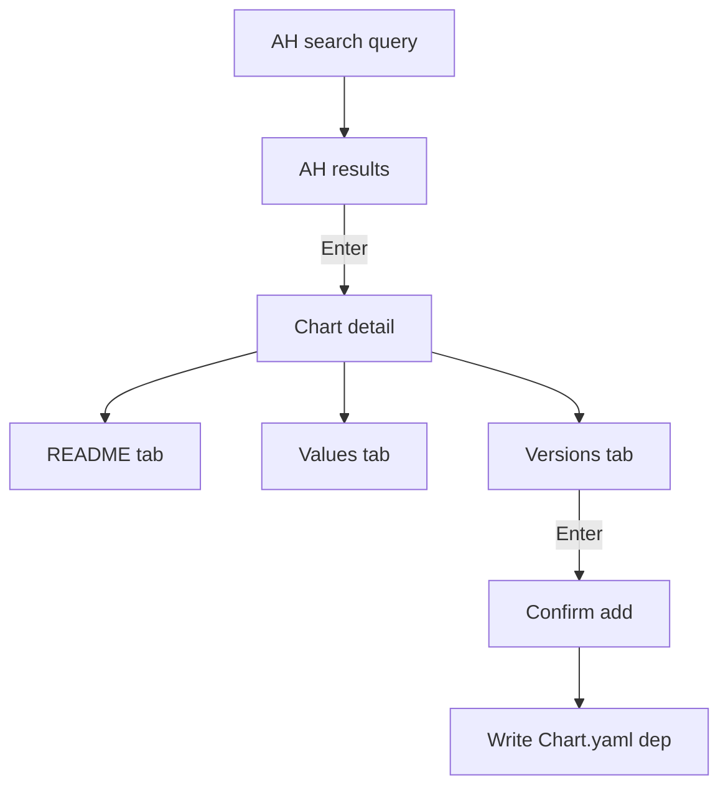

# TUI v0.2: Artifact Hub chart detail screen (Enter on result)

Goal: From Artifact Hub search results, `Enter` opens a **chart detail** screen showing:

- README preview
- Default values preview
- Versions list (pick version)
- Confirm to add dependency to instance

Data source decision (confirmed): use `helm show readme` and `helm show values`.

## UX

Flow:

1. Add dependency → Artifact Hub → search query
2. Results list: `Enter` opens Chart detail
3. Chart detail screen has tabs:
   - README
   - Values
   - Versions
4. In Versions tab, `Enter` selects version (pins exact) and shows confirmation panel
5. Confirm → writes dependency into `Chart.yaml`

Key behavior rule:

- While any text input or list filter is active, do not treat keypresses as global shortcuts.

## Implementation notes

### Isolated helm environment

Do not mutate the user’s global Helm repo config.

Run helm commands with env vars pointing to repo-local state:

- `HELM_CONFIG_HOME = <repo>/.helmdex/helm/config`
- `HELM_CACHE_HOME = <repo>/.helmdex/helm/cache`
- `HELM_DATA_HOME = <repo>/.helmdex/helm/data`

Then:

1. `helm repo add <tempName> <repoURL>`
2. `helm repo update`
3. `helm show readme <tempName>/<chartName> --version <ver>`
4. `helm show values <tempName>/<chartName> --version <ver>`

For OCI charts, use `helm show readme oci://... --version <ver>` (repo add not needed).

### Caching

Cache fetched README/values under:

- `.helmdex/artifacthub/<repoID>/<chartName>/<version>/README.md`
- `.helmdex/artifacthub/<repoID>/<chartName>/<version>/values.yaml`

### TUI model changes

Add a new wizard step: `depStepAHDetail`.

State needed:

- selected package summary (repoID, repoURL, chartName)
- versions list
- active version
- README/values text buffers
- loading state + error state

### Fixing Enter not selecting

If results list filtering is enabled, `Enter` may exit filter mode instead of selecting.

For Artifact Hub results and versions lists:

- disable list filtering to make `Enter` deterministic
- rely on the dedicated search query input for searching

## Mermaid

