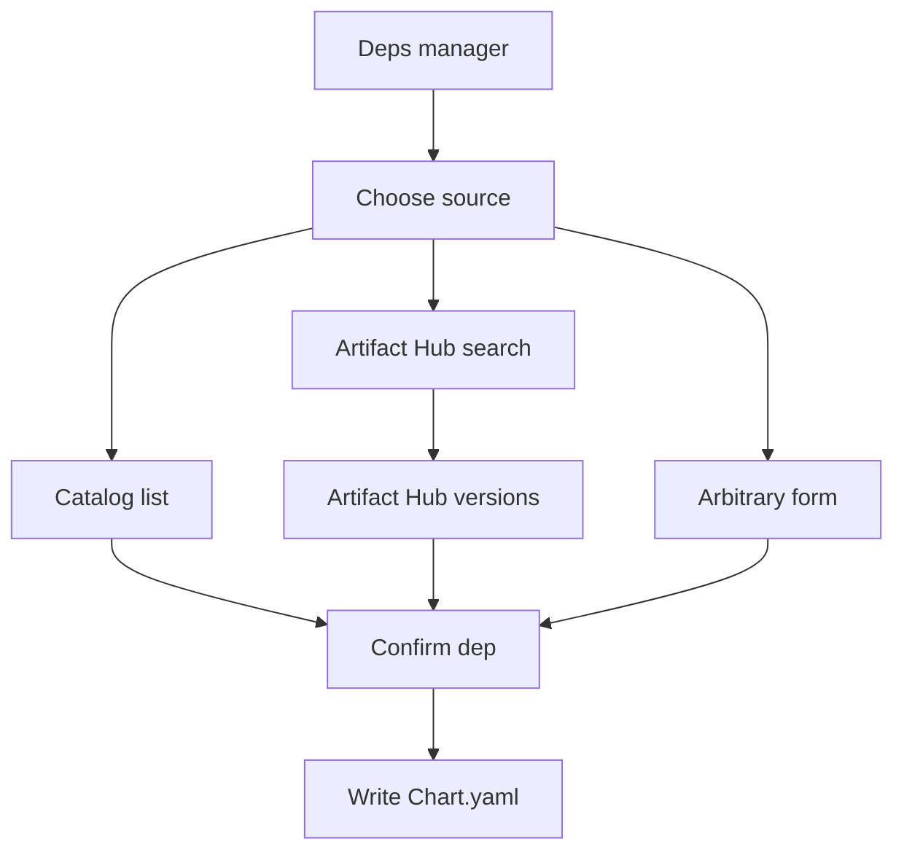

# TUI v0.2: create instance + chart picker (3 sources)

This extends the current dashboard/instance TUI with:

- Create instance from TUI
- Add dependencies by cherry-picking charts from:
  1) predefined catalog (synced locally)
  2) Artifact Hub (search + versions)
  3) arbitrary chart (manual repo/name/version)

## UX flow

### A) Dashboard -> New instance

- Key: `n`
- Form fields:
  - instance name
  - optional: initial chart(s) to add (enter dependency manager immediately)
- On submit:
  - call [`instances.Create()`](internal/instances/instances.go:1)
  - navigate to Instance detail
  - open Dependency manager automatically

### B) Instance detail -> Dependency manager

- Key: `a` to add dependency
- Key: `x` to remove selected dependency
- Key: `p` to change pin/version
- Key: `A` to edit alias
- Key: `space` to toggle inclusion in apply plan (optional)

### C) Add dependency -> Select source

Screen: Choose source

- Predefined catalog
- Artifact Hub
- Arbitrary

### D1) Predefined catalog picker

Inputs:

- searchable list (filter as you type)

Data source:

- parse local cached YAML(s) from [`.helmdex/catalog/*.yaml`](.helmdex/catalog:1)

Selection result:

- dependency draft:
  - repo
  - name
  - version (exact)
  - digest (sha256…) if provided
  - suggested alias (optional)

### D2) Artifact Hub explorer

Step 1: Search

- text input query
- results list: (repo, package name, description)

Step 2: Versions

- fetch versions list for selected package
- pick an exact version

Selection result:

- dependency draft (repo/name/version)
- digest typically unavailable; leave blank

### D3) Arbitrary chart entry

- text inputs:
  - repo URL or OCI ref
  - chart name
  - version (exact)
  - optional alias

## Apply behavior

When the user hits Apply:

- Update `Chart.yaml` dependencies
- Decide whether deps changed; if yes run Helm relock unless user disables
- Generate layers + merged `values.yaml`

v0.2 scope:

- Only manage `Chart.yaml` dependencies; preset generation can remain stubbed.
- `values.yaml` regen is always available.

## Backend work required

### 1) Catalog parsing

Implement:

- [`internal/catalog/model.go`](internal/catalog/model.go:1): `Catalog`, `Entry`
- [`internal/catalog/load.go`](internal/catalog/load.go:1): load and merge entries from `.helmdex/catalog/*.yaml`

Rules:

- stable `entry.id`
- chart coordinates: `repo` + `name` (and optional `oci`)

### 2) Artifact Hub client

Implement:

- [`internal/artifacthub/client.go`](internal/artifacthub/client.go:1)
  - `SearchHelm(query) -> []PackageSummary`
  - `GetHelmPackage(repoID, packageName) -> PackageDetail` including versions

Notes:

- Keep API base URL configurable for tests.
- Add unit tests using `httptest`.

### 3) Chart.yaml editing helpers

Implement YAML Node editing so we preserve formatting + comments:

- [`internal/yamlchart/read.go`](internal/yamlchart/read.go:1): read raw node + typed view
- [`internal/yamlchart/edit.go`](internal/yamlchart/edit.go:1): add/remove/update dependency; enforce alias-or-name uniqueness

### 4) TUI screens

- [`internal/tui/screens/new_instance.go`](internal/tui/screens/new_instance.go:1)
- [`internal/tui/screens/deps.go`](internal/tui/screens/deps.go:1)
- [`internal/tui/screens/picker_source.go`](internal/tui/screens/picker_source.go:1)
- [`internal/tui/screens/picker_catalog.go`](internal/tui/screens/picker_catalog.go:1)
- [`internal/tui/screens/picker_artifacthub_search.go`](internal/tui/screens/picker_artifacthub_search.go:1)
- [`internal/tui/screens/picker_artifacthub_versions.go`](internal/tui/screens/picker_artifacthub_versions.go:1)
- [`internal/tui/screens/picker_arbitrary.go`](internal/tui/screens/picker_arbitrary.go:1)

## Mermaid: add dependency wizard

