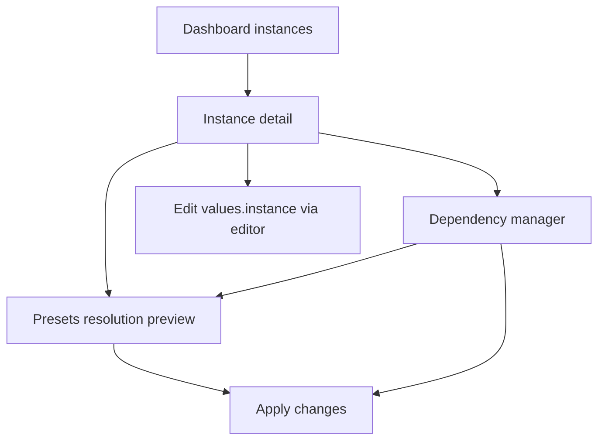

# Helmdex TUI v0.2 plan (dashboard-first)

Goal: a full-screen, dashboard-like TUI to manage a GitOps repo of umbrella instances.

Non-goals (v0.2):

- No in-app YAML editor. Editing user-owned overrides uses `$EDITOR` on [`apps/<instance>/values.instance.yaml`](apps/<instance>/values.instance.yaml:1).
- Catalog selection (predefined, Artifact Hub, arbitrary) can be stubbed behind simple prompts if needed; full wizard can be v0.3.

## Screen map

### 1) Dashboard: instances list

Purpose:

- Discover instances (scan `appsDir`).
- Quick actions.

Data shown per instance:

- Name
- Dependency count (parse [`apps/<instance>/Chart.yaml`](apps/<instance>/Chart.yaml:1))
- Has generated `values.yaml`
- Dirty indicator based on computed diff (optional)

Actions:

- Enter: open instance
- `n`: create instance (shell out to existing create flow, or inline minimal scaffold)
- `d`: delete (confirm)
- `s`: sync catalogs/presets (calls existing [`catalog.Syncer.Sync()`](internal/catalog/sync.go:1))
- `/`: filter
- `q`: quit

Implementation:

- Use `bubbles/list` with custom delegate.
- Backing data from [`instances.List()`](internal/instances/instances.go:1).

### 2) Instance detail

Purpose:

- Single instance overview.

Tabs (top nav):

- Overview
- Deps
- Values
- Presets

Overview shows:

- Instance path
- `Chart.yaml` summary
- Set files present `values.set.*.yaml`
- Last sync info from `.helmdex/cache/<source>/.helmdex-meta.yaml` (optional)

Deps tab shows:

- Table of dependencies from `Chart.yaml` with columns: id (alias-or-name), name, alias, version, repo

Values tab shows:

- Read-only previews (viewport) of:
  - `values.default.yaml` if present
  - `values.platform.yaml` if present
  - `values.set.*.yaml`
  - user-owned `values.instance.yaml`
  - generated `values.yaml`

Actions:

- `e`: open `$EDITOR` for `values.instance.yaml`
- `r`: regenerate merged `values.yaml` by calling [`values.GenerateMergedValues()`](internal/values/generate.go:1)

### 3) Dependency manager

Purpose:

- Add/remove/pin/alias dependencies in `Chart.yaml`.

v0.2 actions:

- Add dependency: minimal form UI (repo URL, chart name, version)
- Remove dependency
- Edit dependency: version and alias

Rules:

- Dependency id for values keying is `alias` if set else `name`.
- Uniqueness enforced.

Output:

- Update [`apps/<instance>/Chart.yaml`](apps/<instance>/Chart.yaml:1) using YAML Node-based editing (new package, see below)
- Mark instance as having pending changes in TUI state.

### 4) Preset resolution preview

Purpose:

- Show which remote preset files would be used for each dependency.

v0.2 scope:

- If presets resolution not implemented yet, display a placeholder panel showing configured sources and their resolved commits.
- Once implemented, show a per-dependency list:
  - selected `values.default.yaml` path
  - selected `values.platform.<platform>.yaml` path
  - selected set files in chosen order

### 5) Apply

Purpose:

- Commit changes to disk (write generated layers + `values.yaml` and optionally relock deps).

Apply steps:

1. If deps changed and relock enabled, run [`helm dependency update/build`](internal/helmutil/deps.go:1)
2. Generate preset layer files (when presets exist)
3. Generate merged `values.yaml`
4. Show summary + return to instance detail

Flags:

- Toggle relock (default automatic: only when deps changed; force via `--relock` equivalent)

## TUI architecture

### Packages (proposed)

- [`internal/tui/app.go`](internal/tui/app.go:1) root Bubble Tea model and global state
- [`internal/tui/nav.go`](internal/tui/nav.go:1) screen stack + routing
- [`internal/tui/screens/dashboard.go`](internal/tui/screens/dashboard.go:1)
- [`internal/tui/screens/instance.go`](internal/tui/screens/instance.go:1)
- [`internal/tui/screens/deps.go`](internal/tui/screens/deps.go:1)
- [`internal/tui/screens/values.go`](internal/tui/screens/values.go:1)
- [`internal/tui/screens/presets.go`](internal/tui/screens/presets.go:1)
- [`internal/tui/screens/apply.go`](internal/tui/screens/apply.go:1)

Support:

- [`internal/tui/editor/editor.go`](internal/tui/editor/editor.go:1) launches `$EDITOR` (suspends alt screen)
- [`internal/tui/styles/styles.go`](internal/tui/styles/styles.go:1) lipgloss styles

### State + messages

- Central `AppModel` holds:
  - repoRoot, config, loaded sources meta
  - instance list cache
  - selected instance
  - pending changes (deps changed bool, sets changed bool)

- Long-running operations (sync, helm relock) run via Bubble Tea commands and return messages with results.

### Entry point

Options:

- `helmdex` with no args launches TUI (recommended)
- `helmdex tui` launches TUI, `helmdex instance ...` stays available

## Required backend work to support TUI

Even with TUI-first, we should keep mutations in backend packages so they are testable:

1. `Chart.yaml` read + write + edit helpers (new)
   - [`internal/yamlchart/read.go`](internal/yamlchart/read.go:1)
   - [`internal/yamlchart/edit.go`](internal/yamlchart/edit.go:1)
2. Dependency diffing (to decide relock)
   - [`internal/instances/diff.go`](internal/instances/diff.go:1)
3. Optional: values preview loader (read files safely)
   - [`internal/values/load.go`](internal/values/load.go:1)

## UX defaults

- Keybindings align with common TUIs:
  - arrows or `j/k` navigation
  - `enter` to open
  - `esc` to go back
  - `q` to quit
  - `?` help overlay

## Testing approach

- Keep backend edits in pure functions where possible.
- For TUI itself, smoke test model initialization + update loops without snapshotting the terminal.

